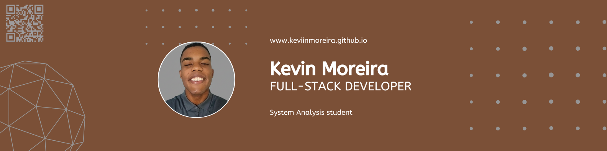

---

 
 👋 Hi, I'm Kevin Moreira

   Full-Stack Developer and Systems Analysis student focused on building practical, scalable, and well-structured solutions.  
   I enjoy turning ideas into clean, efficient code through real-world projects.

---
  
  🚀 Current Focus:
  
- Personal portfolio with performance and accessibility in mind  
- Backend APIs using Python and FastAPI  
- Full-stack applications with modern web technologies
  
---

🛠️ Tech Stack:

**Languages:** Python, JavaScript/TypeScript, C/C++/C#  
**Frontend:** HTML, CSS, React, Next.js  
**Backend:** Node.js, Django, FastAPI  
**Databases:** MySQL, MongoDB
**Tools:** Git, Docker, Postman, Firebase, Vercel, Google Cloud, AWS, Azure  

---

  💌 Let's connect our ideas: ⤵️

  

  

  

  

> *Code is not just about syntax — it's about solving real problems with clarity.*
